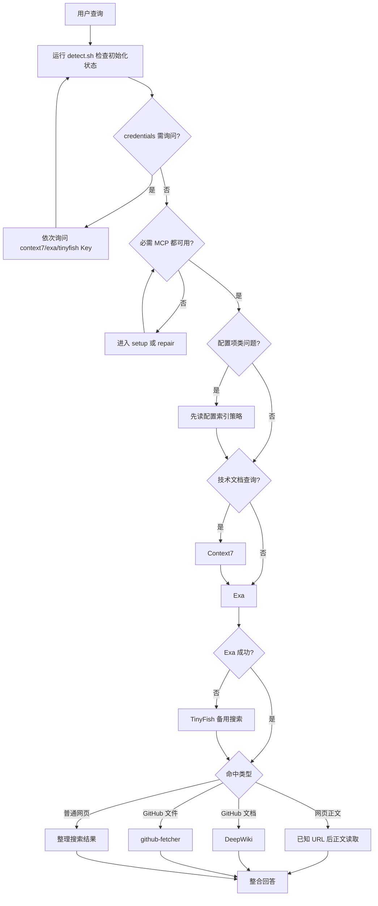
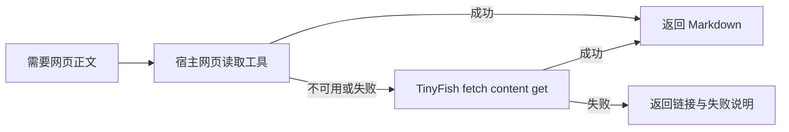

# Search-Web 技能使用示例

本文档提供 `search-web` skill 的参数示例、搜索链路示例和常见失败示例。

## 何时读取本文件

- 只需要最小执行流程时，不读本文件，直接按 `SKILL.md` 执行
- 需要 `Context7`、`Exa`、`TinyFish`、网页正文读取或 `DeepWiki` 的参数示例时，读取对应章节
- 需要 `Context7` 的错误示范、调用顺序示例或多源整合案例时，优先读取“Context7 文档搜索”
- 需要网页读取降级策略时，读取“网页正文读取降级”
- 需要常见失败场景或排障提示时，读取“常见问题处理”
- 需要配置或修复必需 MCP 时，直接跳到 `../references/setup.md`

## 基本搜索流程



固定规则：

1. 使用时先运行 detect.sh 确认初始化状态和真实环境
2. MCP 缺失时先通过 `setup-mcp.sh` 安装，然后提示用户重启以激活
3. 技术文档问题先走 `Context7`
4. 联网搜索先使用 `Exa`；`Exa` 搜索失败、额度到限、服务不可用或空结果时，切换到 `TinyFish` CLI
5. `Context7` 之后仍继续走 `Exa`
6. 命中 GitHub 仓库文档时走 `DeepWiki`，需要读取仓库文件或目录时走 `github-fetcher`
7. 网页正文读取只允许发生在“已知 URL 的非搜索读取”阶段；宿主读取失败时可用 `tinyfish fetch content get`

## 首次使用示例

```text
1. 运行 bash scripts/detect.sh（无参数），解析输出
2. 如果 agent=unknown，跳过 setup 直接进入步骤 3；MCP 在实际调用时不可用则停止并告知用户
3. 检查 credentials/ 目录下 context7、exa 和 tinyfish 文件
4. 如果 credentials/context7 文件不存在或为空，询问是否配置 Context7 Key
5. 如果 credentials/exa 文件不存在或为空，询问是否配置 Exa Key
6. 如果 credentials/tinyfish 文件不存在或为空，但当前环境已有 TINYFISH_API_KEY，先写回 credentials/tinyfish 并跳过询问
7. 如果 credentials/tinyfish 文件不存在或为空，且当前环境没有 TINYFISH_API_KEY，询问是否配置 TinyFish Key
8. 用户提供 TinyFish Key 后，写入 credentials/tinyfish，并永久写入 TINYFISH_API_KEY
9. 逐项复验 context7、exa、mcp-deepwiki、github-fetcher
10. 如果任一项缺失，执行 `bash scripts/setup-mcp.sh --mcp all` 安装，告知用户重启并停止当前搜索
11. 四项 MCP 已在当前会话可用后，才开始正式搜索
```

## Context7 文档搜索

### 固定调用顺序

1. 从用户请求中提炼 `libraryName`
2. 从用户请求中提炼聚焦后的 `query`
3. 调用 `mcp__context7__resolve-library-id({ libraryName, query })`
4. 从解析结果中选择 `libraryId`
5. 调用 `mcp__context7__query-docs({ libraryId, query })`
6. 再调用 `Exa` 补网页资料、最新信息或官方入口
7. `Exa` 失败、额度到限、服务不可用或空结果时，按 `../references/tinyfish-fallback.md` 使用 `TinyFish`

### 选择结果的规则

- 优先选择 Source Reputation 更高的结果
- 在同等信誉下，优先选择 Benchmark Score 更高的结果
- 如果用户明确提到版本，优先选择匹配版本的文档
- 不允许跳过解析步骤手写或猜测 `libraryId`

### 最小正确调用模板

```json
mcp__context7__resolve-library-id({
  "libraryName": "redis",
  "query": "architecture types deployment modes"
})
```

```json
mcp__context7__query-docs({
  "libraryId": "/redis/docs",
  "query": "architecture types deployment modes"
})
```

### 常见错误示范

```yaml
# 错误 1：缺少 libraryName
tool: mcp__context7__resolve-library-id
parameters:
  query: "redis"
```

```yaml
# 错误 2：把 libraryName 传给 query-docs
tool: mcp__context7__query-docs
parameters:
  libraryName: "redis"
  query: "architecture types deployment modes"
```

```yaml
# 错误 3：猜测 libraryId
tool: mcp__context7__query-docs
parameters:
  libraryId: "/redis/guess"
  query: "architecture types deployment modes"
```

## Exa 网络搜索

固定规则：

- 联网搜索先使用 `Exa`
- `Exa` 失败、额度到限、服务不可用或空结果时，切换到 `TinyFish` CLI
- 降级时必须说明 `Exa` 的失败原因
- 不得切换到未指定搜索工具

### 示例 1：通用网页搜索

```yaml
tool: mcp__exa__web_search_exa
parameters:
  query: "Next.js 15 new features release notes"
  numResults: 5
```

### 示例 2：限定官方域名

```yaml
tool: mcp__exa__web_search_exa
parameters:
  query: "React Server Components official guide"
  allowed_domains: ["react.dev"]
  numResults: 5
```

## TinyFish 备用搜索

固定前提：

- 仅在 `Exa` 搜索失败、额度到限、服务不可用或空结果时使用
- 使用前先确认 `credentials/tinyfish` 不是 `skipped`
- 使用前确保 `TINYFISH_API_KEY` 已从 `credentials/tinyfish` 注入当前会话
- 完整安装、Key 写入和正文抓取规则见 `../references/tinyfish-fallback.md`

### 示例 1：备用搜索

```bash
tinyfish search query "Next.js 15 release notes"
```

### 示例 2：地区化搜索

```bash
tinyfish search query "best restaurants in Tokyo" --location "Japan" --language "ja"
```

## 网页正文读取降级

固定前提：

- 用户已经给出明确 URL，或 `Exa` / `TinyFish` 已经命中目标网页
- 本阶段是“读取正文”，不是“继续搜索”
- 如果宿主没有提供正文读取工具或读取失败，可用 `tinyfish fetch content get` 备用

### 读取策略



### 完整示例

```yaml
original_url: "https://example.com/blog/article"

# 使用宿主已提供的网页读取工具（如 mcp__web-reader__webReader）
tool: mcp__web-reader__webReader
parameters:
  url: "https://example.com/blog/article"

# 宿主读取失败后，使用 TinyFish 备用
command: tinyfish fetch content get "https://example.com/blog/article" --format markdown
```

## GitHub 仓库查询

### 示例 1：仓库概览

```yaml
tool: mcp__mcp-deepwiki__deepwiki_fetch
parameters:
  url: "vercel/next.js"
  maxDepth: 0
  mode: "aggregate"
```

### 示例 2：仓库深读

```yaml
tool: mcp__mcp-deepwiki__deepwiki_fetch
parameters:
  url: "vitejs/vite"
  maxDepth: 1
  mode: "aggregate"
  verbose: true
```

## GitHub 仓库文件与目录读取

### 示例 1：读取仓库文件

```yaml
tool: mcp__github-fetcher__fetch-file
parameters:
  ownerName: "vercel"
  repoName: "next.js"
  filePath: "package.json"
```

### 示例 2：读取目录结构

```yaml
tool: mcp__github-fetcher__fetch-sub-tree
parameters:
  ownerName: "vitejs"
  repoName: "vite"
  dirPath: "packages/vite/src"
  maxDepth: 2
```

### DeepWiki 与 github-fetcher 的协作

- `DeepWiki` 负责仓库级别的文档概览和深读（`deepwiki_fetch`）
- `github-fetcher` 负责读取仓库中具体文件内容和目录结构（`fetch-file`、`fetch-sub-tree`、`fetch-subdir-tree`）
- 两者互补，不互相替代

## 完整示例

### 示例 1：技术文档 + 网页补充

```yaml
# 前置检查：已通过 bash scripts/detect.sh 确认 initialized=true，且 context7、exa、mcp-deepwiki 已通过复验；TinyFish Key 已按需写入 credentials/tinyfish 和 TINYFISH_API_KEY

# 第一阶段：Context7
tool: mcp__context7__resolve-library-id
parameters:
  libraryName: "react"
  query: "React Server Components usage"

tool: mcp__context7__query-docs
parameters:
  libraryId: "/facebook/react"
  query: "React Server Components how to use with examples"

# 第二阶段：Exa
tool: mcp__exa__web_search_exa
parameters:
  query: "React Server Components official guide migration pitfalls"
  numResults: 5
  allowed_domains: ["react.dev"]

# Exa 失败、额度到限、服务不可用或空结果时
command: tinyfish search query "React Server Components official guide migration pitfalls"
```

### 示例 2：最新资讯

```yaml
# 前置检查：已通过 bash scripts/detect.sh 确认 initialized=true，且 context7、exa、mcp-deepwiki 已通过复验；TinyFish Key 已按需写入 credentials/tinyfish 和 TINYFISH_API_KEY

# 第一阶段：Context7
tool: mcp__context7__resolve-library-id
parameters:
  libraryName: "next.js"
  query: "Next.js 15 new features"

tool: mcp__context7__query-docs
parameters:
  libraryId: "/vercel/next.js"
  query: "Next.js 15 release notes features"

# 第二阶段：Exa
tool: mcp__exa__web_search_exa
parameters:
  query: "Next.js 15 release notes new features"
  numResults: 5

# Exa 失败、额度到限、服务不可用或空结果时
command: tinyfish search query "Next.js 15 release notes new features"
```

### 示例 3：文档 + 仓库联合分析

```yaml
# 前置检查：已通过 bash scripts/detect.sh 确认 initialized=true，且 context7、exa、mcp-deepwiki 已通过复验；TinyFish Key 已按需写入 credentials/tinyfish 和 TINYFISH_API_KEY

# 第一阶段：Context7
tool: mcp__context7__resolve-library-id
parameters:
  libraryName: "vite"
  query: "Vite plugin system architecture"

tool: mcp__context7__query-docs
parameters:
  libraryId: "/vitejs/vite"
  query: "How to create Vite plugins, plugin API"

# 第二阶段：Exa
tool: mcp__exa__web_search_exa
parameters:
  query: "Vite plugin system architecture official guide"
  numResults: 5

# 第三阶段：DeepWiki
tool: mcp__mcp-deepwiki__deepwiki_fetch
parameters:
  url: "vitejs/vite"
  maxDepth: 1
  mode: "aggregate"
```

### 示例 4：首次使用时先修复依赖

```text
当前状态：detect.sh 输出 initialized=false，或部分 MCP 不可用
处理方式：执行 `bash scripts/setup-mcp.sh --mcp all` 安装缺失 MCP，创建标志文件，然后告知用户重启以激活，并停止当前搜索
TinyFish 不是 MCP，缺失时提示 `npm install -g @tiny-fish/cli`，并按 `credentials/tinyfish` 写入 `TINYFISH_API_KEY`
```

### 示例 5：宿主类型未识别时跳过检测

```text
当前状态：`bash scripts/detect.sh` 输出 `agent=unknown`
处理方式：跳过 setup，直接尝试后续搜索流程；MCP 在实际调用时不可用则停止并告知用户需手动配置
```

## 常见问题处理

### Q1：`Context7` 超限怎么办？

```text
每个问题最多调用 Context7 3 次。
超限后直接改用 Exa，不再继续消耗 Context7 次数。
```

### Q2：网页清洗都失败了怎么办？

```text
直接说明该网页无法自动清洗，只返回原始链接和失败原因。
```

### Q3：GitHub 仓库查询失败怎么办？

```text
如果是 mcp-deepwiki 或 github-fetcher 缺失或环境错误，通过 `setup-mcp.sh` 安装并提示用户重启。
如果环境正常但仓库不可达，直接说明仓库可能私有、已删除或当前网络不可达，不把失败包装成已读取成功。
github-fetcher 读取失败时不要回退到 DeepWiki 替代文件读取，反之亦然。
```

### Q4：`Exa` 不可用时怎么办？

```text
先判断失败类型。
如果是 MCP 未注册或未加载，通过 `setup-mcp.sh` 安装并提示用户重启。
如果是搜索失败、额度到限、服务不可用或空结果，读取 `credentials/tinyfish`，确保 `TINYFISH_API_KEY` 已注入当前会话，然后运行 `tinyfish search query`。
如果 `credentials/tinyfish=skipped`、CLI 未安装或 Key 不可用，直接说明 TinyFish 不可用。
```

## MCP 工具快速参考

| 工具 | 用途 | 关键参数 |
| --- | --- | --- |
| `mcp__context7__resolve-library-id` | 解析库名称 | `libraryName`, `query` |
| `mcp__context7__query-docs` | 查询技术文档 | `libraryId`, `query` |
| `mcp__exa__web_search_exa` | 通用网页搜索 | `query`, `numResults`, `allowed_domains` |
| `mcp__exa__web_fetch_exa` | 批量读取已知 URL 正文 | `urls`, `maxCharacters` |
| `mcp__mcp-deepwiki__deepwiki_fetch` | GitHub 仓库查询 | `url`, `maxDepth`, `mode` |
| `mcp__github-fetcher__fetch-file` | 读取 GitHub 仓库文件 | `ownerName`, `repoName`, `filePath` |
| `mcp__github-fetcher__fetch-sub-tree` | 读取 GitHub 仓库目录结构 | `ownerName`, `repoName`, `dirPath`, `maxDepth` |
| `mcp__github-fetcher__fetch-subdir-tree` | 读取 GitHub 仓库子目录 | `ownerName`, `repoName`, `dirPath` |

## CLI 备用工具快速参考

| 工具 | 用途 | 关键参数 |
| --- | --- | --- |
| `tinyfish search query` | Exa 失败后的备用网页搜索 | 查询文本、`--location`、`--language` |
| `tinyfish fetch content get` | 已知 URL 后的备用正文抓取 | URL、`--format markdown`、`--links` |
