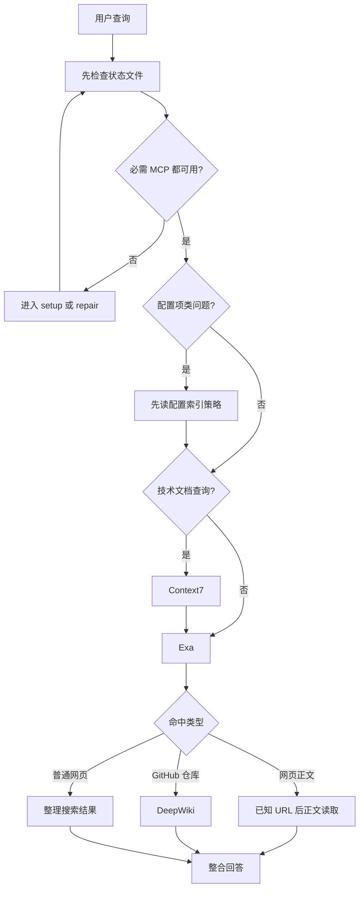
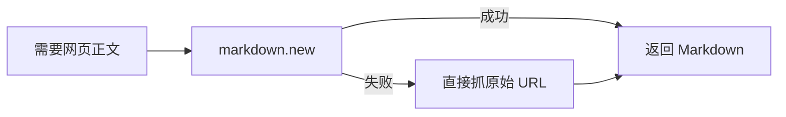

# Search-Web 技能使用示例

本文档提供 `search-web` skill 的参数示例、搜索链路示例和常见失败示例。

## 何时读取本文件

- 只需要最小执行流程时，不读本文件，直接按 `SKILL.md` 执行
- 需要 `Context7`、`Exa`、网页正文读取或 `DeepWiki` 的参数示例时，读取对应章节
- 需要 `Context7` 的错误示范、调用顺序示例或多源整合案例时，优先读取“Context7 文档搜索”
- 需要网页读取降级策略时，读取“网页正文读取降级”
- 需要常见失败场景或排障提示时，读取“常见问题处理”
- 需要配置或修复必需 MCP 时，直接跳到 `../references/setup.md`

## 基本搜索流程



固定规则：

1. 使用时先检查状态文件和真实环境
2. `Context7`、`Exa`、`DeepWiki` 任一缺失都先修复
3. 技术文档问题先走 `Context7`
4. 联网搜索固定只用 `Exa`，不得切换其他搜索型 MCP
5. `Context7` 之后仍继续走 `Exa`
6. 命中 GitHub 仓库时优先走 `DeepWiki`
7. 网页正文读取只允许发生在“已知 URL 的非搜索读取”阶段，不能替代 `Exa`

## 首次使用示例

```text
1. 先运行 sh scripts/detect-agent.sh
2. 如果结果是 unknown，立即停止 setup 并说明无法识别当前宿主
3. 再读取 bootstrap-state.json
4. 逐项复验 context7、exa、mcp-deepwiki
5. 如果任一项缺失，立即进入 references/setup.md
6. 所有必需项通过后，才开始正式搜索
```

## Context7 文档搜索

### 固定调用顺序

1. 从用户请求中提炼 `libraryName`
2. 从用户请求中提炼聚焦后的 `query`
3. 调用 `mcp__context7__resolve-library-id({ libraryName, query })`
4. 从解析结果中选择 `libraryId`
5. 调用 `mcp__context7__query-docs({ libraryId, query })`
6. 再调用 `Exa` 补网页资料、最新信息或官方入口
7. 不允许用其他搜索型 MCP 代替 `Exa`

### 选择结果的规则

- 优先选择 Source Reputation 更高的结果
- 在同等信誉下，优先选择 Benchmark Score 更高的结果
- 如果用户明确提到版本，优先选择匹配版本的文档
- 不允许跳过解析步骤手写或猜测 `libraryId`

### 最小正确调用模板

```json
mcp__context7__resolve-library-id({
  "libraryName": "redis",
  "query": "architecture types deployment modes"
})
```

```json
mcp__context7__query-docs({
  "libraryId": "/redis/docs",
  "query": "architecture types deployment modes"
})
```

### 常见错误示范

```yaml
# 错误 1：缺少 libraryName
tool: mcp__context7__resolve-library-id
parameters:
  query: "redis"
```

```yaml
# 错误 2：把 libraryName 传给 query-docs
tool: mcp__context7__query-docs
parameters:
  libraryName: "redis"
  query: "architecture types deployment modes"
```

```yaml
# 错误 3：猜测 libraryId
tool: mcp__context7__query-docs
parameters:
  libraryId: "/redis/guess"
  query: "architecture types deployment modes"
```

## Exa 网络搜索

固定规则：

- 联网搜索必须使用 `Exa`
- `Exa` 不可用时，返回 `references/setup.md` 做修复
- 不得切换到 `open-websearch` 或其他搜索型 MCP

### 示例 1：通用网页搜索

```yaml
tool: mcp__exa__web_search_exa
parameters:
  query: "Next.js 15 new features release notes"
  numResults: 5
  type: "auto"
```

### 示例 2：限定官方域名

```yaml
tool: mcp__exa__web_search_exa
parameters:
  query: "React Server Components official guide"
  includeDomains: ["react.dev"]
  numResults: 5
```

### 示例 3：代码上下文搜索

```yaml
tool: mcp__exa__get_code_context_exa
parameters:
  query: "Rust async await tutorial examples"
  numResults: 5
```

## 网页正文读取降级

固定前提：

- 用户已经给出明确 URL，或 `Exa` 已经命中目标网页
- 本阶段是“读取正文”，不是“继续搜索”
- 如果宿主没有提供正文读取工具，就只返回链接与失败说明

### 两层降级策略



### 完整示例

```yaml
original_url: "https://example.com/blog/article"

# Tier 1
tool: mcp__fetch__fetch
parameters:
  url: "https://markdown.new/https://example.com/blog/article"
  max_length: 5000

# Tier 2
tool: mcp__fetch__fetch
parameters:
  url: "https://example.com/blog/article"
  raw: false
  max_length: 5000
```

## GitHub 仓库查询

### 示例 1：仓库概览

```yaml
tool: mcp__mcp-deepwiki__deepwiki_fetch
parameters:
  url: "vercel/next.js"
  maxDepth: 0
  mode: "aggregate"
```

### 示例 2：仓库深读

```yaml
tool: mcp__mcp-deepwiki__deepwiki_fetch
parameters:
  url: "vitejs/vite"
  maxDepth: 1
  mode: "aggregate"
  verbose: true
```

## 完整示例

### 示例 1：技术文档 + 网页补充

```yaml
# 前置检查：已通过 sh scripts/detect-agent.sh 唯一确认当前宿主，且 bootstrap-state.json 中的 context7、exa、mcp-deepwiki 已通过复验

# 第一阶段：Context7
tool: mcp__context7__resolve-library-id
parameters:
  libraryName: "react"
  query: "React Server Components usage"

tool: mcp__context7__query-docs
parameters:
  libraryId: "/facebook/react"
  query: "React Server Components how to use with examples"

# 第二阶段：Exa
tool: mcp__exa__web_search_exa
parameters:
  query: "React Server Components official guide migration pitfalls"
  numResults: 5
  includeDomains: ["react.dev"]
```

### 示例 2：最新资讯

```yaml
# 前置检查：已通过 sh scripts/detect-agent.sh 唯一确认当前宿主，且 bootstrap-state.json 中的 context7、exa、mcp-deepwiki 已通过复验

# 第一阶段：Context7
tool: mcp__context7__resolve-library-id
parameters:
  libraryName: "next.js"
  query: "Next.js 15 new features"

tool: mcp__context7__query-docs
parameters:
  libraryId: "/vercel/next.js"
  query: "Next.js 15 release notes features"

# 第二阶段：Exa
tool: mcp__exa__web_search_exa
parameters:
  query: "Next.js 15 release notes new features"
  numResults: 5
```

### 示例 3：文档 + 仓库联合分析

```yaml
# 前置检查：已通过 sh scripts/detect-agent.sh 唯一确认当前宿主，且 bootstrap-state.json 中的 context7、exa、mcp-deepwiki 已通过复验

# 第一阶段：Context7
tool: mcp__context7__resolve-library-id
parameters:
  libraryName: "vite"
  query: "Vite plugin system architecture"

tool: mcp__context7__query-docs
parameters:
  libraryId: "/vitejs/vite"
  query: "How to create Vite plugins, plugin API"

# 第二阶段：Exa
tool: mcp__exa__web_search_exa
parameters:
  query: "Vite plugin system architecture official guide"
  numResults: 5

# 第三阶段：DeepWiki
tool: mcp__mcp-deepwiki__deepwiki_fetch
parameters:
  url: "vitejs/vite"
  maxDepth: 1
  mode: "aggregate"
```

### 示例 4：首次使用时先修复依赖

```text
当前状态：bootstrap-state.json 不存在，或其中的 context7 / exa / mcp-deepwiki 任一未通过
处理方式：先进入 references/setup.md 完成 setup，再返回主流程
```

### 示例 5：宿主信号冲突时停止

```text
当前状态：`sh scripts/detect-agent.sh` 返回 `unknown`
处理方式：直接返回 unknown，不继续猜配置路径，也不开始 setup
```

## 常见问题处理

### Q1：`Context7` 超限怎么办？

```text
每个问题最多调用 Context7 3 次。
超限后直接改用 Exa，不再继续消耗 Context7 次数。
```

### Q2：网页清洗都失败了怎么办？

```text
直接说明该网页无法自动清洗，只返回原始链接和失败原因。
```

### Q3：GitHub 仓库查询失败怎么办？

```text
如果是 mcp-deepwiki 缺失或环境错误，先回到 references/setup.md 修复。
如果环境正常但仓库不可达，直接说明仓库可能私有、已删除或当前网络不可达，不把失败包装成已读取成功。
```

### Q4：`Exa` 不可用时能不能换别的搜索 MCP？

```text
不能。
联网搜索固定只允许 `Exa`。
`Exa` 缺失、未注册或连接失败时，必须回到 references/setup.md 修复。
```

## MCP 工具快速参考

| 工具 | 用途 | 关键参数 |
| --- | --- | --- |
| `mcp__context7__resolve-library-id` | 解析库名称 | `libraryName`, `query` |
| `mcp__context7__query-docs` | 查询技术文档 | `libraryId`, `query` |
| `mcp__exa__web_search_exa` | 通用网页搜索 | `query`, `numResults`, `includeDomains` |
| `mcp__exa__get_code_context_exa` | 代码与技术资料搜索 | `query`, `numResults` |
| `mcp__fetch__fetch` | 获取已知 URL 的网页正文，不参与搜索 | `url`, `max_length`, `raw` |
| `mcp__mcp-deepwiki__deepwiki_fetch` | GitHub 仓库查询 | `url`, `maxDepth`, `mode` |
